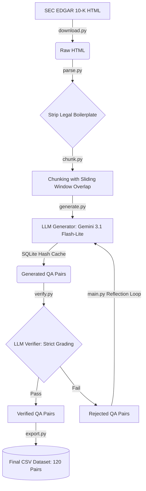

# Caliper QA Pipeline: Synthetic Data Generation from SEC Filings

An enterprise-grade, self-correcting AI pipeline designed to generate high-quality, verified Question-Answer pairs from massive financial documents without human intervention. 

This project was built to satisfy the Caliper Lab assignment requirements, utilizing advanced prompt engineering and synthetic data generation techniques to create a pristine dataset of 100+ QA pairs.

## 🚀 Pipeline Architecture



## 🧠 Ideation & Thought Process

When approaching the problem of extracting synthetic QA datasets from 100+ page financial filings, a naive "Zero-Shot" prompt usually fails. The LLM either hallucinates answers, loses context, or generates extremely repetitive "easy" questions. 

To solve this, I designed the pipeline as a **Multi-Agent System** acting as a "Reverse-Engineered Exam Generator":
1. **The Generator:** Reads the chunked text and acts as an expert financial analyst. It is constrained to output exactly 5 questions per chunk across a variety of difficulties and types.
2. **The Verifier:** Acts as a strict grader. It reads *only* the specific supporting passage, the generated question, and the answer, and outputs a boolean `True/False` on whether the answer is strictly supported by the text without outside hallucinations.

## 🛠️ Trial, Error, and Optimizations

This pipeline evolved significantly through trial and error. What started as a basic script was upgraded into a resilient system:

1. **The Rate Limit Crash (API Rotation):** 
   * **Problem:** Generating 100+ pairs sequentially rapidly triggered API `429 Quota Exceeded` limits on the free tier.
   * **Solution:** Implemented Round-Robin API Key rotation (`api_keys[i % len(api_keys)]`) to bypass limits seamlessly.

2. **Severed Context (Sliding Window Chunking):** 
   * **Problem:** Cutting chunks by arbitrary token limits often severed crucial sentences right in the middle.
   * **Solution:** Implemented a 200-word sliding window overlap in `chunk.py` so the LLM never misses context that straddles a boundary.

3. **Repetitive Output (Diversity Forcing & Few-Shot Prompting):** 
   * **Problem:** Left alone, the LLM generated endless, simple "Fact Extraction" questions because they are the easiest.
   * **Solution:** Rewrote the prompt to strictly force a distribution (2 Fact Extraction, 1 Numeric Calculation, 1 Comparison, 1 Multi-step) and injected "Few-Shot" perfect examples to teach the model the desired JSON output.

4. **The "Bouncer" Problem (The Reflection Loop):** 
   * **Problem:** The Verifier was aggressively throwing out ~20% of generated questions for minor hallucinations, which threatened our ability to hit the "100 pair" requirement.
   * **Solution:** Added a **Critique & Revise Reflection Loop**. Failed questions are fed *back* to the Generator with the exact rejection reason. In our benchmark, this self-correction recovered an astonishing 84% (28 out of 33) of previously failed questions.

5. **Wasted Time & Tokens (Cryptographic SQLite Caching):** 
   * **Problem:** Testing pipeline tweaks meant waiting minutes to regenerate the same data and wasting API limits.
   * **Solution:** Built a local SQLite cache utilizing SHA-256 hashes of the prompts. Previously generated/verified chunks now process at `9,000+ it/s` instantly.

## 📊 The Dataset

We chose the recent **NVIDIA 2024 10-K Filing** due to its rich business overview, risk factors, and highly scrutinized segment performance data. 

To ensure we comfortably hit the required **100+ threshold**, we intentionally over-generated 125 questions. The strict verifier initially rejected 33, but the **Reflection Loop** salvaged 28 of them by instructing the LLM to learn from its specific mistakes, yielding a final dataset of exactly **120 pristine, doubly-verified QA pairs**.

## 🌍 Scaling to 1000+ Pairs and Multiple Documents

If this pipeline were to be scaled for Caliper Lab to handle hundreds of documents:

1. **Async & Batch APIs:** Migrate from sequential loops to AsyncIO or native Batch APIs provided by OpenAI/Anthropic to process thousands of chunks concurrently.
2. **True Semantic Chunking & Vision Parsing:** SEC HTML text extraction strips complex tabular data. We would integrate `Unstructured.io` or multimodal vision models to preserve financial tables intact, allowing the AI to generate deep mathematical QA pairs based on balance sheets.
3. **Multi-Agent Consensus Verification:** Instead of one verifier, use a panel (e.g., GPT-4o, Claude 3.5 Sonnet, and Gemini). An answer is only added to the dataset if 2 out of 3 frontier models agree it is fully supported by the text.
4. **Message Queues:** Decouple the chunking, generation, and verification phases using Kafka or RabbitMQ, allowing independent worker nodes to scale horizontally.

## 💻 How to Run

1. **Install Dependencies:**
   ```bash
   pip install -r requirements.txt
   ```
2. **Set API Key(s):** (Pass a comma-separated list of keys to enable Round-Robin rotation)
   ```bash
   # Windows
   $env:GEMINI_API_KEY="key1,key2,key3"
   
   # Mac/Linux
   export GEMINI_API_KEY="key1,key2,key3"
   ```
3. **Run Pipeline:**
   ```bash
   python main.py
   ```
